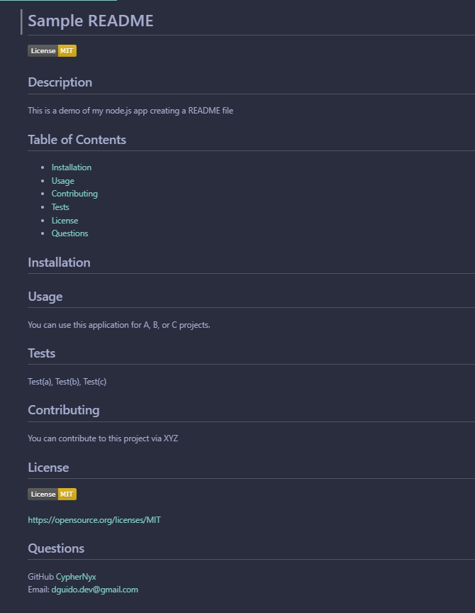

# Node.js - Inquirer README Generator
> Module 9 Challenge Node.js: Professional README Generator

This application utilizes Node.js and the [inquirer NPM](https://www.npmjs.com/package/inquirer/v/9.2.8) package to capture user input through the command line interface and generate a personalized README file.<br><br>


## Table of Contents
  * [Demo](#demo)
  * [Installation](#installation)
  * [Usage](#usage)
  * [Contributing](#contributing)
  * [License](#license)
  * [Questions](#questions)
<br><br>
## 


## Demo
Here is a link to the video of the Application Demo:<br>
[Node.js README Generator -DEMO ➡️](url)

## Installation
To use the README Generator, you'll need to have Node.js installed on your computer. Once you have Node.js set up, you can follow these steps to install and use the application:

1. Clone this GitHub repository to your local machine. <br> 
```sh
git clone git@github.com:CypherNyx/markdown-file-generator.git
```
2. Open a terminal or command prompt and navigate to the cloned repository's directory.
3. Run ```npm install``` to install the necessary dependencies.

## Usage
To generate a professional README for your project, follow these steps:

1. Open a terminal or command prompt and navigate to the README Generator directory.
2. Run the application using the command <br>
```sh
node index.js
```
3. Answer the prompted questions about your application repository.
4. Once you have provided all the required information, the application will generate a file named README-inq.md in the same directory with the appropriate sections and content.

### *License - Prompt*
Choose a license for your application from the list of options provided during the README generation process. The selected license will be added as a badge near the top of the generated README. Additionally, a notice will be included in the License section, indicating which license your application is covered under.

### *Contributing - Prompt*
If you want others to contribute to your project, you can include contribution guidelines in the generated README. Provide information on how others can contribute to your project and any guidelines they should follow.

### *Tests - Prompt*
Include instructions on how to run tests for your application in the generated README. By providing clear test instructions, others can easily verify the functionality of your project.

## Contributing
1. Fork it (<https://github.com/CypherNyx/markdown-file-generator/fork>)
2. Create your feature branch (`git checkout -b suggest/new-feature`)
3. Commit your changes (`git commit -m 'Add some new-feature'`)
4. Push to the branch (`git push origin suggest/new-feature`)
5. Create a new Pull Request

## License
[](https://opensource.org/licenses/MIT)
  
  https://opensource.org/licenses/MIT 

## Questions
If you have any questions or need further assistance, you can reach me via the following:

  GitHub: [Dahlia Guido's GitHub](https://github.com/CypherNyx) <br>
  Email: dguido.dev@gmail.com

